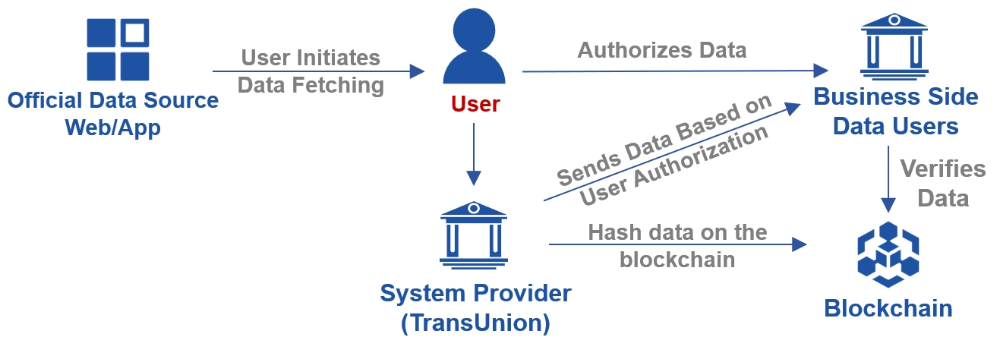

## Overview

Nowadays, it is difficult for individual users to effectively ensure the authenticity and trustworthiness of their provided data. To address this issue, we developed Data Express Chain, focusing on the portability of personal data in Fintech area. Users proactively and independently initiate personal data transfer process, including fetching and authorizing data to 3rd party all by themselves. Afterwards, Data Express Chain incorporates blockchain technology to realize trustworthy and tamper-proof data verification. This process ensures the authenticity and reliability of data transfer among multiple organizations, and it aims to build a basic infrastructure for trusted personal data exchange.

## Terminology

| **Terminology** | **Meaning**                                                                                                         |
| --------------------- | ------------------------------------------------------------------------------------------------------------------------- |
| DECS                  | Abbreviation for Data Express Chain System                                                                                |
| Data Fetching         | The procedure that user login to the official website or application, download and authorize the specified data to you |
| System Provider       | Organization to deploy the DECS system (e.g. TransUnion)                                                                  |
| System User           | User of DECS to conduct data fetching                                                                                     |
| Trusted Environment   | Remote clean and trusted software environment where data fetching is done                                                 |
| VDI                   | The specific Virtual Machine of a trusted environment                                                                     |
| Success Page          | The page after a successful data fetching, provided by you                                                                |
| Failure Page          | The page after a failed data fetching, provided by you                                                                   |
| Original-File         | The original data file acquired directly from data source                                                                 |
| Original-File-Parsing | Parsing the Original-File into readable json format (Parsed-File)                                                        |
