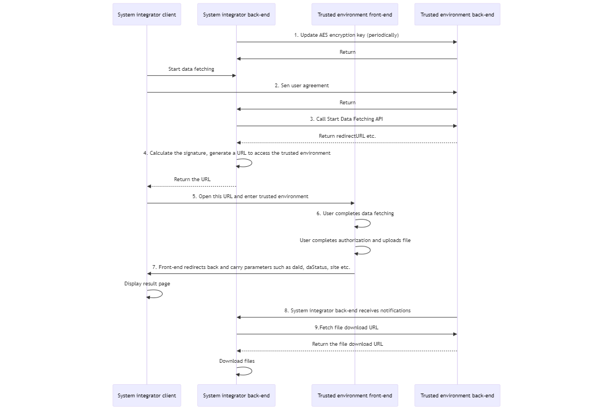

Note: This document is primarily intended for technical personnel to facilitate the assessment of specific development tasks and integration. This page is an overview of the integration process. Detailed interface specifications can be accessed by clicking on the links provided in the document.

## 1. Prerequisites

* The System Integrator needs to provide the following information:

  * Name of the System Integrator
  * Public Key (Refer to the [appendix](/en/access/appendix?id=_6-how-to-generate-rsa-public-and-private-key-pair) to generate RSA public-private key-pair, and upload rsa_public_key.pem)
  * Backend Callback Notification URL
  * URL for the HTML5 Front-end Successful Data Retrieval Page ("Success Page"): The page URL redirected to and shown to users upon successful data retrieval
  * URL for the HTML5 Front-end Data Retrieval Failure Page ("Failure Page"): The page URL redirected to and shown to users upon failed data retrieval
    * URL allows query parameters not exceeding 12 Bytes length
    * Must be in http/https format
    * URL should not include a question mark (?). Paths and queries are allowed.
    * If the URL already contains a query, do NOT use the following keys: status, bizNo, daId, daStatus, site, attach_url
  * Alert Email address
  * IP List of Backend Servers, to receive backend callback notifications
  * Per-hour system requests usage estimation
  * Whether to receive backend notification (daStatus)
* The System Integrator should contact the System Provider to apply for appId and appKey based on the above information, and go through the basic process for integration.

Please Note:

1. appId and appKey must be kept confidential, where appKey will be sent to the System Integrator securely. If appKey is leaked, insecure or unavailable service requests might happen and the System Integrator assumes all risks at its own peril.
2. The appId and appKey for the test environment and production environment are different.
3. API's domain name for the production environment will be provided to System Integrator separately.

## 2. Basic Process



1. System integrator back-end calls the [AES Key Updating](/en/access/main?id=_21-aes-key-updatinge) API to obtain the AES key.
   * The AES key needs to be stored and used by all other systems.
2. System integrator back-end calls the [User Agreement Uploading](/en/access/main?id=_22-user-agreement-uploading) API to submit the user agreement.
3. System integrator back-end calls the [Start Data Fetching](/en/access/main?id=_23-start-data-fetching) API to obtain the **daId** and **redirectUrl**.
   * **daId** is the unique primary key for all other systems to share and track one data fetching request.
4. System integrator back-end uses the RSA private key to calculate the **signature**, append the generated signature to the **redirectUrl**, and generate a full URL to access to the trusted environment. Refer to [Trusted Environment URL Generation](/en/access/main?id=_235-trusted-environment-url-generation).
5. System integrator client opens this URL.
6. User do the actual data fetching and confirm to authorize data.
7. Trusted environment front-end redirects back from the trusted environment, carrying parameters: **bizNo**, **daId**, **daStatus**, **site** and **attach_url**. If data fetching is successful, it will open the Success Page and **daStatus** will be 0 (in progress), 5 (downloading) or 10 (downloaded); otherwise it will load the Failure Page and the **daStatus** will be > 10 (failure state).
8. System integrator back-end receives the user data fetching status notification from the trusted environment and handle it based on [Notification](/en/access/main?id=_3-notification).
9. System integrator back-end downloads the **Original-File** and **Parsed-File**, refering to [Downloading files](/en/access/main?id=_34-downloading-files).

## 3. Important Notes

The redirection to Success Page or Failure Page is triggered when data fetching is done:

* If data fetching is successful, it will redirect to Success Page.
* Otherwise (data fetching fails which might be due to e.g. timeout), it will redirect to Failure Page.

The front-end redirection in to these two pages, is via API *window.location.replace()*, carrying **bizNo, daId, daStatus, site** in query form, and may have **attach_url** and **status**.

* bizNo, site: same as arg.bizNo and arg.site when calling start-vdi-x
* attach_url: same as arg.ext.urlattach when calling start-vdi-x
* daId, daStatus: the daId and daStatus for current data fetching request
  * When data fetching is successful, the daStatus will either be 0 (in progress), 5 (downloading), or 10 (download completed terminal state). When data fetching fails, the daStatus in the front-end callback will either be a failure state (>10) or -60000 (general failure).
  * Example result URL:

```
https://www.yyy.com/jumpChannel.html?attach_url=channel_a&bizNo=acf1700443444e7b9206c6d5b36ec955&daId=zd240e1e1722158295759228928&site=app-tax-income&daStatus=10
```

If your data fetching request is in an iOS/Android mobile application, please note:

- We CANNOT close our own HTML5 page or webview container.
- If user triggered a "cancel" popup alert, and confirmed "exit", it will actually call *history.go(-1)*. In this case, trusted environment will redirect to the previous page before data fetching process is invoked, retaining the browsing history.
- If users directly close the entire application, no front-end redirection can be invoked.
- Due to the fact that different applications might use multi-process/thread model, there is no guarantee that the webview container that opened trusted environment can be completely closed after *window.location.replace()*.

**Best practice**:
Configure a transit page as a unified success/failure page entry point. Then, devise your own redirection logic to the actual post data-fetching page, based on the received query parameters e.g. bizNo and daStatus. Finally, close the trusted environment webview container via your application.

**Fallback Logic**:
It is recommended to destroy the trusted environment page, activity, or webview container completely after data fetching is done. This can ensure consistent web history and prevent any residual webview containers.

**Fallback Logic 2**:
If your application framework has a Back button, please confirm whether it might trigger a return back to the trusted environment page. If this happens, remember to destroy the relevant pages, activities, or webviews of the trusted environment.

**Fallback Logic 3**:
If the trusted environment page cannot be directly destroyed, we suggest to forcefully redirect to the correct business page on the transit page. This can reduce the risk of users returning to the trusted environment page.
