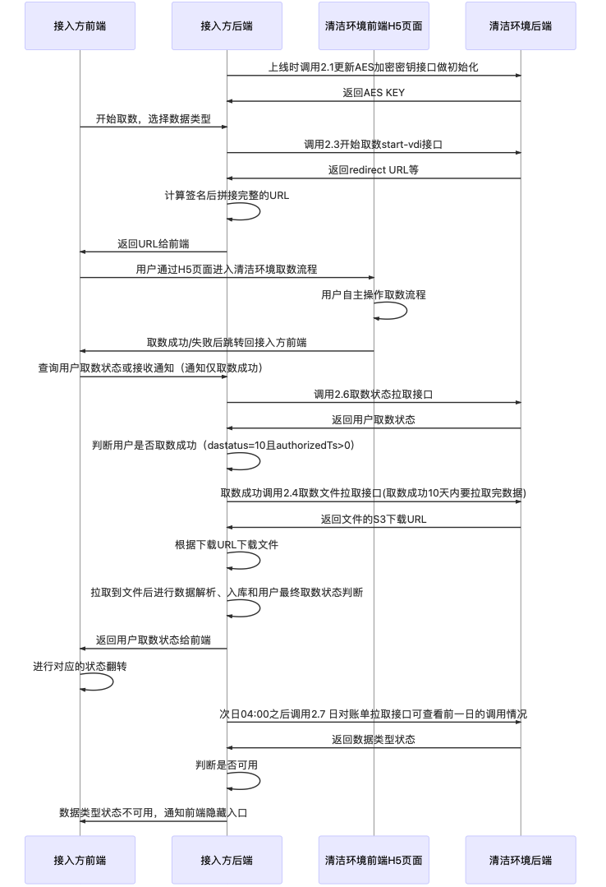

注：此文档主要阅读对象为**技术人员**，便于评估对接的具体开发工作及接入。此页面为接入概览，详细接口请根据文中链接点击跳转。

## 1. 接入方需要提供的信息
* 接入方需提供如下信息：
  * 接入方的名字
  * 公钥（参考[附录](/zh/access/appendix?id=_5-如何生成rsa公私钥)生成RSA公私钥，其中rsa_public_key.pem为所生成的公钥）
  * 后台回调通知URL
  * H5前端取数成功页面URL（“结果页”）：用户取数成功会自动跳入的页面
  * H5前端取数失败页面URL（“数据列表页”）：用户取数失败会自动跳入的页面
    * 这两个页面支持携带不超过12个字符的动态参数
    * 必须是http/https的
    * url不要带问号?，可以带路径、query
    * url如果包含query，不要使用status、bizNo、daId、daStatus、site、attach_url作为key
  * 告警邮箱
  * 业务侧后台服务器的 IP 列表（即接收后台回调通知的后台服务，用于我们配置防火墙的出网 IP 白名单）
  * 生产环境上线后，每日 24 小时的大概使用量分布（用于保证 VDI 机器数量够用）
  * 是否需要取数状态（daStatus）变化通知
* 接入方联系清洁环境取数平台的产品提供方，申请 appId、appKey，并按照下述接入指引生成签名。  

注意：
1. appId、appKey 务必保密，其中 appKey 会通过单独的方式发送给接入方。appKey 一旦泄露，将会导致服务的请求不安全或者不可用，后果由接入方自行承担；  
2. 测试环境和生产环境的 appId、appKey 不同，发布生产环境时需替换为生产环境 appId、appKey  
3. 生产环境的 API 域名会另行提供  


## 2.  基本接入流程



1. **接入方后端**调用 3.1 [更新AES加密秘钥](/zh/access/main?id=_31-更新aes加密秘钥接口) 接口，获取AES密钥
    * AES密钥需要分发给所有其他子系统
2. **接入方后端**调用3.4 [发送用户协议给清洁环境](/zh/access/main?id=_34-用户协议签署接口)接口，传入用户身份证号，提交用户协议
3. **接入方后端**调用3.3 [start-vdi-x接口](/zh/access/main?id=_33-start-vdi-x-接口-（sdk和h5接入模式使用该接口）)，获取用于跳转清洁环境的 daId 和 redirectURL
    * **daId为所有其他子系统共用的、单笔取数的唯一主键**
4. **接入方后端**使用RSA私钥计算签名，把生成的签名拼接在redirectUrl后面，生成进入清洁环境页面完整URL。参考3.3.1 [如何生成跳转到清洁环境的URL](/zh/access/main?id=_231-生成清洁环境的-url)
5. **接入方前端**使用此URL，进入清洁环境H5页面取数
6. 用户在打开的清洁环境里完成取数，并点击同意提交完成授权
7. **清洁环境前端**在用户取数结束后，跳转到接入方预先提供的结果页面，跳转时携带bizNo、daId、daStatus、site。
8. **接入方后端**接收清洁环境的用户取数状态通知，参考[接收通知说明](/zh/access/main?id=_4-通知（v2格式）接入方的接口说明)
9. **接入方后端**下载取数原始文件，参考4.4 [返回值下载实例](/zh/access/main?id=_44-返回值下载实例)
<!-- 10. 同理，后端接收清洁环境的存管证书生成通知并下载存管证书 -->

## 3.  注意事项 

成功页和结果页的概念为取数完成时触发的前端回调：
* 如果用户**成功完成取数，**会进入配置的取数成功结果页；  
* 如果用户**超时退出**、或**取数失败**（如非本人登录），会进入配置的取数失败的数据源页；  

以上两种方式的前端回调跳转是通过window.location.replace方式硬跳转的，**跳转时以query形式携带bizNo、daId、daStatus、site，可能有attach_url及status**。  
* bizNo、site：调用start-vdi-x时由arg.bizNo和arg.site传入
* attach_url：调用start-vdi-x时由arg.ext.urlattach传入
* daId、daStatus：当笔取数的daId和daStatus
  * 取数成功时，前端回调的daStatus为0（取数中）、5（下载中）或10（下载完成终态）。取数失败时前端回调的daStatus为失败终态（>10），或-60000（通用失败）。
  * 结果 URL 示例如下：
```java
https://www.yyy.com/jumpChannel.html?attach_url=channel_a&bizNo=acf1700443444e7b9206c6d5b36ec955&daId=zd240e1e1722158295759228928&site=app-tax-income&daStatus=10
```  

如果您的调用是在APP内通过H5方式接入并配置，请注意：
* 我们没办法干掉自己的H5页面或webview容器。  
* 如果用户通过某种方式触发“**取消不做**”的弹窗，并点击“**确认退出**”，则实际上是通过history.go(-1)方式跳转的，这时候会跳入取数流程的前一个页面，也会保留历史记录，但不会携带任何业务字段。  
* 如果用户直接干掉了您的整个app的话，因为整个webview直接没了，所以也不会收到任何前端返回的业务字段。  
* 由于不同的app可能使用多进程/线程模式，因此不能保证跳转之后window.location.replace跳转后webview被完整干掉。 

**最佳实践**：配置一个**中转页**作为成功/失败页面，并在这个页面里，根据跳入的bizNo、daStatus等信息，决定如何跳转到真正的业务页面，并干掉清洁环境的页面。  

兜底逻辑：不论是配置的成功页还是失败页，都建议在这个页面里，**主动销毁掉清洁环境的页面、activity或webview**，保证前进后退的逻辑一致，也保证不会有残留的webview。

兜底逻辑2：如果您的app有后退按钮，需要确认这个后退按钮的实现逻辑，它是否可能会触发重新回到清洁环境页面。如果出现这种情况，请谨记销毁清洁环境的相关页面、activity或webview。

兜底逻辑3：如果实在没有办法销毁清洁环境页面，可以在中转页面进行强制设置跳转到正确的业务页面，降低用户强制回退回到清洁环境页面的操作风险。

